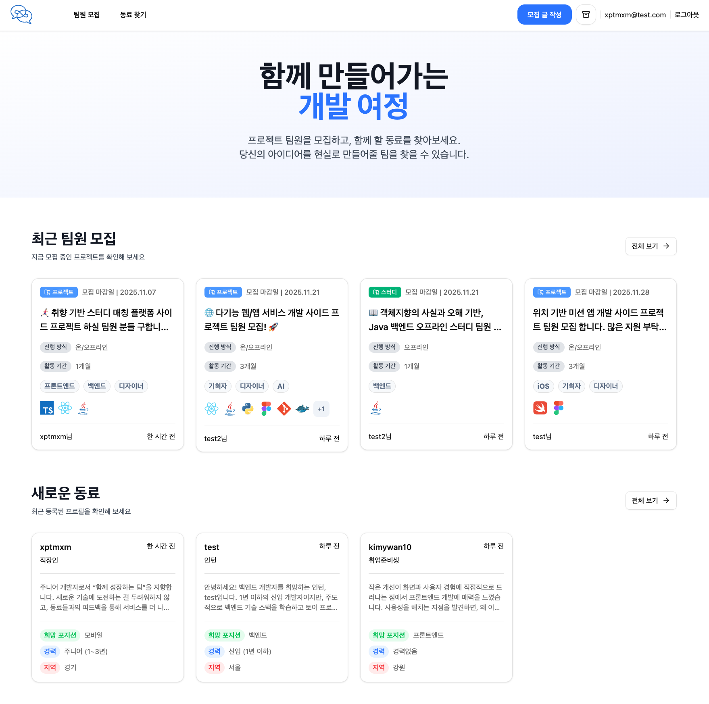
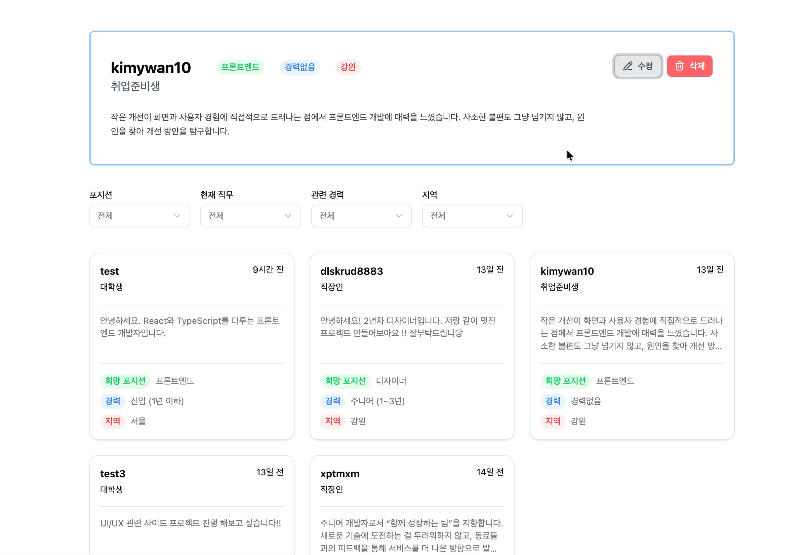
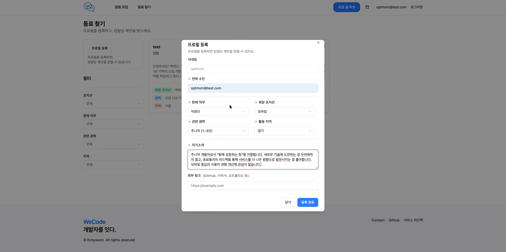

# WeCode

**"팀 프로젝트와 스터디를 쉽게 찾고 참여할 수 있는 매칭 플랫폼"**



## 📋 프로젝트 소개

개발을 혼자 공부하기 어려우신가요? 함께할 팀원을 찾고 계신가요?  
WeCode에서 같은 목표를 가진 개발자들과 연결되어 함께 성장해보세요!

### 주요 특징

WeCode는 **팀원 모집 글 작성**뿐만 아니라 **프로필 등록**을 통해 팀 빌딩 제안을 받을 수 있는 양방향 매칭 플랫폼입니다.

## ✨ 주요 기능

### 🏠 메인 페이지

- **카테고리별 게시글 조회** : 최근 프로젝트/스터디 모집글 및 등록 프로필 조회

### 📝 게시글

- **텍스트 에디터** : BlockNote 기반 텍스트 편집
- **임시저장 기능** : 작성 중인 글을 임시로 저장하고 이어서 작성
- **상세 정보 입력**
  - 모집 인원, 진행 기간, 모집 마감일
  - 진행 방식 (온라인/오프라인)

### 👥 동료 찾기

- **개발자 프로필 등록**
  - 직무, 포지션, 경력 정보
  - 활동 지역, 자기소개
  - 외부 링크
- **프로필 및 필터링** : 원하는 조건의 동료 찾기

<br />

## 프로젝트 시연





## 프로젝트 구조

```
src/
├── components/ # 재사용 가능한 컴포넌트
│ ├── common/ # 공통 컴포넌트 (Header, Footer 등)
│ ├── recruits/ # 동료 찾기 관련 컴포넌트
│ ├── write/ # 글쓰기 관련 컴포넌트 (Editor, FileUpload 등)
│ ├── ui/ # Shadcn/ui 기반 UI 컴포넌트
│ └── constants/ # 상수 정의 (카테고리, 옵션 등)
├── pages/ # 페이지 컴포넌트
│   ├── auth/ # 인증 관련 페이지 (OAuth 콜백)
│   ├── find-teammates/ # 팀원 찾기 페이지
│   ├── post/ # 게시글 관련 페이지 (작성, 상세)
│   ├── recruit/ # 모집 페이지
│   └── sign-in/ # 로그인/회원가입 페이지
├── hooks/ # 커스텀 훅 (인증)
├── lib/ # Supabase, SWR 등 유틸리티
├── stores/ # Zustand 상태 관리
└── types/ # TypeScript 타입 정의
```

## 기술 스택

### Frontend

- **React**
- **TypeScript**
- **Vite**
- **React Router**

### Styling & UI

- **Tailwind CSS**
- **Shadcn/ui**

### State Management & Forms

- **Zustand**
- **React Hook Form**
- **Zod**

### Backend & Database

- **Supabase**

### Text Editor

- **BlockNote**
